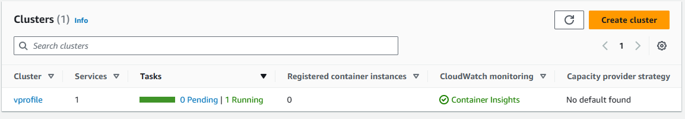
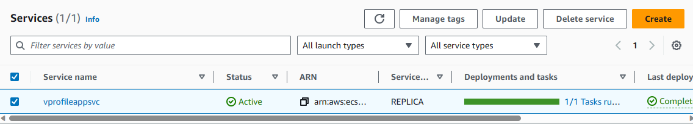

# Project-6: Continuous Delivery using Docker, Amazon ECR, AWS CLI and Amazon ECS.

[*Project Source*](https://www.udemy.com/course/decodingdevops/learn/lecture/32412840#overview)

## Pre-requisities:

 * Jenkins
 * Nexus
 * SonarQube
 * Maven
 * Git
 * Docker 
 * Amazon ECR 
 * ECS Cluster 
 * AWS CLI


## In the previous project - Continuous Integration using Jenkins, Nexus, SonarQube, and Slack, the pipeline has now been extended to Continuous Delivery using Docker, Amazon ECR, AWS CLI and Amazon ECS.

### Step-1: Install Docker Engine in Jenkins
- SSH into the jenkins server and run the below commands to install awscli and docker engine
 ```sh
 sudo -i
sudo apt update && sudo apt install awscli -y
sudo apt-get update
sudo apt-get install ca-certificates curl gnupg -y
sudo install -m 0755 -d /etc/apt/keyrings
curl -fsSL https://download.docker.com/linux/ubuntu/gpg | sudo gpg --dearmor -o /etc/apt/keyrings/docker.gpg
sudo chmod a+r /etc/apt/keyrings/docker.gpg
echo \
  "deb [arch="$(dpkg --print-architecture)" signed-by=/etc/apt/keyrings/docker.gpg] https://download.docker.com/linux/ubuntu \
  "$(. /etc/os-release && echo "$VERSION_CODENAME")" stable" | \
  sudo tee /etc/apt/sources.list.d/docker.list > /dev/null
sudo apt-get update
sudo apt-get install docker-ce docker-ce-cli containerd.io docker-buildx-plugin docker-compose-plugin -y
systemctl status docker
```

### Step-2: Create an IAM user and Elastic Container Registry (ECR) repository
- Create an IAM user for Jenkins to access ECR repository and create the ECR repository.
- Download the Access key as this would be used for AWS credentials.
```sh
User name : jenkins
Permission policies : AmazonEC2ContainerRegustryFullAccess
                      AmazonECS_FullAccess
Generate Access key
```
- ECR repository
```sh
create repository
Visibility settings: private
Repository name: 058666586202.dkr.ecr.us-east-1.amazonaws.com/ vprofileappimg
```

### Step-3: Install plugins
- Install plugins below for Jenkins.
```sh
Docker Pipeline
Amazon ECR
Amazon Web Services SDK 
CloudBees Docker Build and Publish
```
- Install AWS credentials
- Go to `Manage Jenkins` -> `Global Tool Configuration` Install AWS credentials
```sh
Id: awscred
Description: awscred
Access key ID:
Secret Access Key:
```

### Step-4: Configure Docker engine to build and upload image to Amazon ECR
- Run the below pipeline in jenkins to configure docker engine to build and upload image

```sh
pipeline {
    agent any
    tools {
     maven "MAVEN3"
     jdk "OracleJDK8"
 }

    environment {
        registryCredential = 'ecr:us-east-1:awscreds'
        appRegistry = "Registry URL"
        vprofileRegistry = "https://Registry URL"
    }
  stages {
    stage('Fetch code'){
      steps {
        git branch: 'docker', url: 'https://github.com/devopshydclub/vprofile-project.git'
      }
    }

    stage('Test'){
      steps {
        sh 'mvn test'
      }
    }

    stage ('CODE ANALYSIS WITH CHECKSTYLE'){
            steps {
                sh 'mvn checkstyle:checkstyle'
            }
            post {
                success {
                    echo 'Generated Analysis Result'
                }
            }
        }

        stage('build && SonarQube analysis') {
            environment {
             scannerHome = tool 'sonar4.8'
          }
            steps {
                withSonarQubeEnv('sonar') {
                 sh '''${scannerHome}/bin/sonar-scanner -Dsonar.projectKey=vprofile \
                   -Dsonar.projectName=vprofile-repo \
                   -Dsonar.projectVersion=1.0 \
                   -Dsonar.sources=src/ \
                   -Dsonar.java.binaries=target/test-classes/com/visualpathit/account/controllerTest/ \
                   -Dsonar.junit.reportsPath=target/surefire-reports/ \
                   -Dsonar.jacoco.reportsPath=target/jacoco.exec \
                   -Dsonar.java.checkstyle.reportPaths=target/checkstyle-result.xml'''
                }
            }
        }

        stage("Quality Gate") {
            steps {
                timeout(time: 1, unit: 'HOURS') {
                    // Parameter indicates whether to set pipeline to UNSTABLE if Quality Gate fails
                    // true = set pipeline to UNSTABLE, false = don't
                    waitForQualityGate abortPipeline: true
                }
            }
        }

    stage('Build App Image') {
       steps {
       
         script {
                dockerImage = docker.build( appRegistry + ":$BUILD_NUMBER", "./Docker-files/app/multistage/")
             }

     }
    
    }

    stage('Upload App Image') {
          steps{
            script {
              docker.withRegistry( vprofileRegistry, registryCredential ) {
                dockerImage.push("$BUILD_NUMBER")
                dockerImage.push('latest')
              }
            }
          }
     }

  }
}
```


### Step-5: Create Elastic Container Service (ECS) cluster
- Create an ECS cluster in AWS and create a task definition and service for running the Docker container.
- Go to ECS -> Create cluster use the following properties
```sh
Cluster name: vprofile
Vpc & subnet: default
Infrastructure: AWS Fargate(serverless)
Monitoring: enable "use container insight"
```



- Go to `ECS` -> `Task definitions` create Task definition using the following properties
```sh
Task definition family: vprofileapptask
Container: vproapp
Image Url: <ECRimage url>
Port: 8080
App Environment: AWS Fargate
Others: Default
```


- Go to `ECS` -> `cluster`, click on `services`,create cluster using the following properties
```sh
Task definition family: vprofileapptask
Service name: vprofileappsvc
Desired Task: 1
Load Balancer type: Application Load Balancer
Load Balancer name: Vprofileappelbecs
Port: 80
Target Group: vproesctg
Health check: /login
security Group: vproappecselb-sg
HTTP, port 80, Allow from anywhere
Others: Default
```


- Go to `Health check` and `Security group`, allow traffic from port8080, use the following properties
```sh
Health check: 8080 (Http traffic port)
Health threshold: 2
security Group: Custom Tcp, port 8080 allow from both Ipv4 and Ipv6
```


### Step-6: Deploy the Docker Image to ECS using Jenkins pipeline.
```sh
pipeline {
    agent any
    tools {
     maven "MAVEN3"
     jdk "OracleJDK8"
 }

    environment {
        registryCredential = 'ecr:us-east-1:awscreds'
        appRegistry = "058666586202.dkr.ecr.us-east-1.amazonaws.com/vprofileappimg"
        vprofileRegistry = "https://058666586202.dkr.ecr.us-east-1.amazonaws.com"
        cluster = "vprofile"
        service = "vprofileappsvc"
    }
  stages {
    stage('Fetch code'){
      steps {
        git branch: 'docker', url: 'https://github.com/devopshydclub/vprofile-project.git'
      }
    }

    stage('Test'){
      steps {
        sh 'mvn test'
      }
    }

    stage ('CODE ANALYSIS WITH CHECKSTYLE'){
            steps {
                sh 'mvn checkstyle:checkstyle'
            }
            post {
                success {
                    echo 'Generated Analysis Result'
                }
            }
        }

        stage('build && SonarQube analysis') {
            environment {
             scannerHome = tool 'sonar4.8'
          }
            steps {
                withSonarQubeEnv('sonar') {
                 sh '''${scannerHome}/bin/sonar-scanner -Dsonar.projectKey=vprofile \
                   -Dsonar.projectName=vprofile-repo \
                   -Dsonar.projectVersion=1.0 \
                   -Dsonar.sources=src/ \
                   -Dsonar.java.binaries=target/test-classes/com/visualpathit/account/controllerTest/ \
                   -Dsonar.junit.reportsPath=target/surefire-reports/ \
                   -Dsonar.jacoco.reportsPath=target/jacoco.exec \
                   -Dsonar.java.checkstyle.reportPaths=target/checkstyle-result.xml'''
                }
            }
        }

        stage("Quality Gate") {
            steps {
                timeout(time: 1, unit: 'HOURS') {
                    // Parameter indicates whether to set pipeline to UNSTABLE if Quality Gate fails
                    // true = set pipeline to UNSTABLE, false = don't
                    waitForQualityGate abortPipeline: true
                }
            }
        }

    stage('Build App Image') {
       steps {
       
         script {
                dockerImage = docker.build( appRegistry + ":$BUILD_NUMBER", "./Docker-files/app/multistage/")
             }

     }
    
    }

    stage('Upload App Image') {
          steps{
            script {
              docker.withRegistry( vprofileRegistry, registryCredential ) {
                dockerImage.push("$BUILD_NUMBER")
                dockerImage.push('latest')
              }
            }
          }
     }
     
     stage('Deploy to ecs') {
          steps {
        withAWS(credentials: 'awscreds', region: 'us-east-1') {
          sh 'aws ecs update-service --cluster ${cluster} --service ${service} --force-new-deployment'
        }
      }
     }

  }
}
```


## Step-7: Clean up